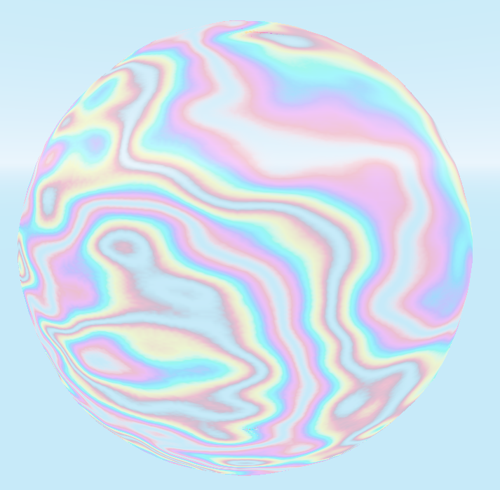

## EXP Iridescence Shader v.1.0.0
#### By David Lipps aka Dave the Dev at EXPWorlds for Godot 3.2 Stable
---

---

A gradiant based iridescense shader. 

  If this project helped you out, consider sending some coffee my way so I can stay locked in "the zone" and bring the Godot community more cool free stuff.

---
**Parameter Discriptions:**
- Wavelength: Higher numbers increase the wave count.
- Wavespeed: How fast the waves animate.
- Alpha: The translucence of the object.
- Displacement: The amont the noise displacment texture can translate the vertices from their original position.
- Displacement Speed: How fast the noise displacement texture animates the object.
- Noise Texture: The perlin noise texture that offsets the waves.
- Noise Displacement Texture: The perlin noise texture that displaces vertices.
- Gradiant: The gradiant texture which defines the visible spectrum of the waves.

---
I can be reached at: davidlipps.dev@gmail.com
I'd love to hear your thoughts. Especially about how I can improve. I'll do my best to get back to you.